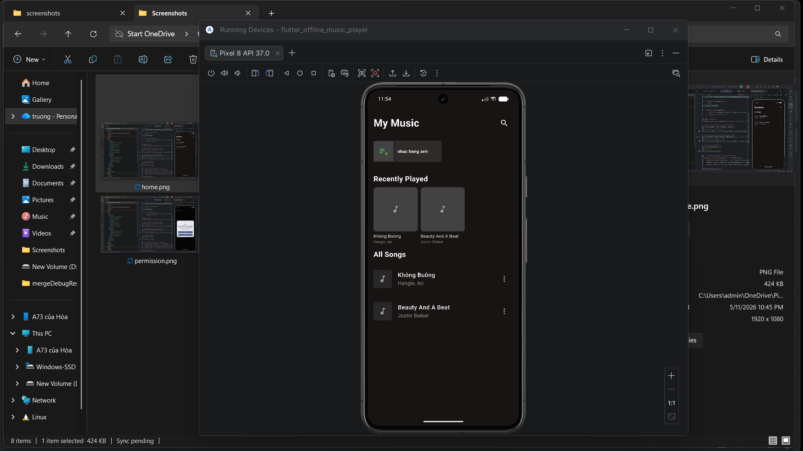
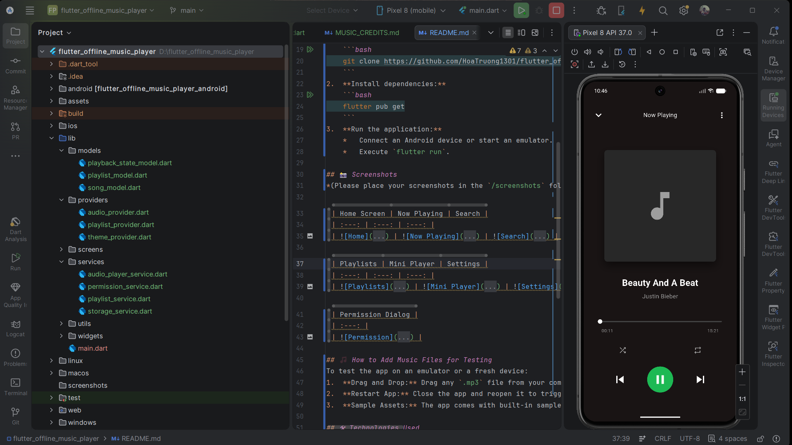
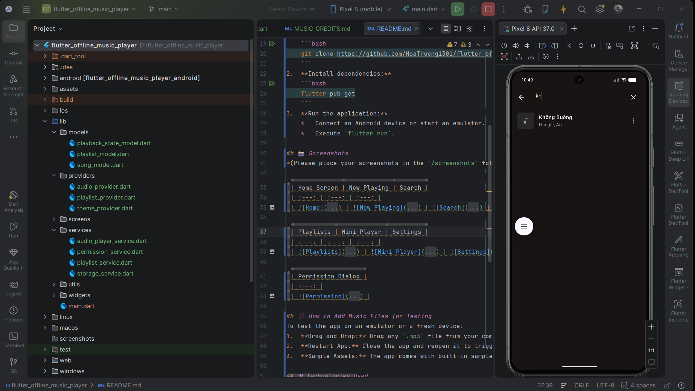
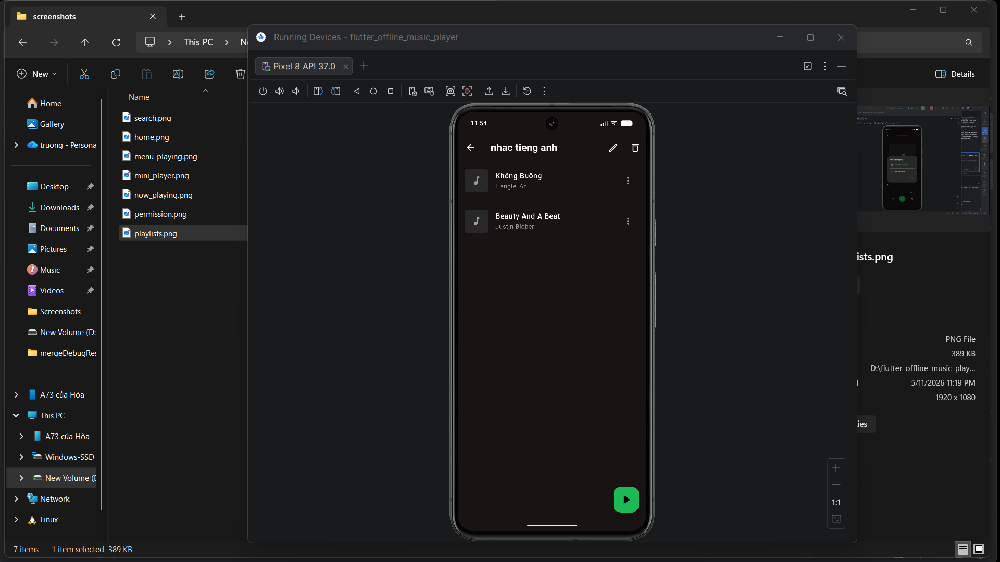
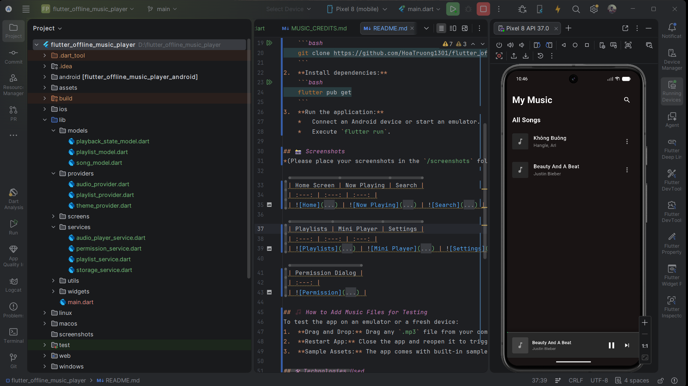
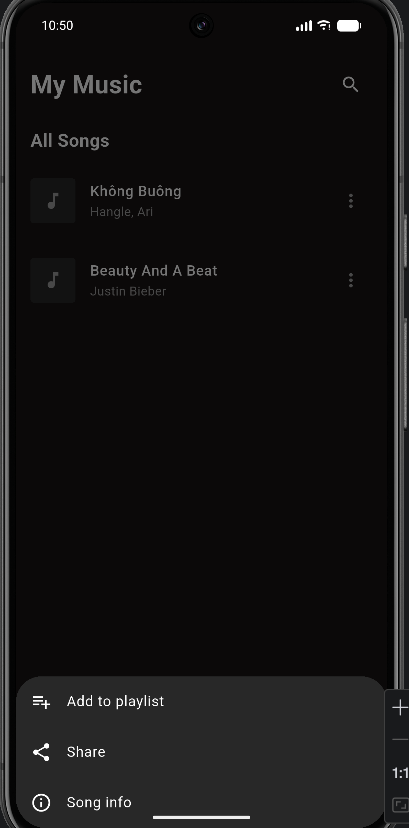
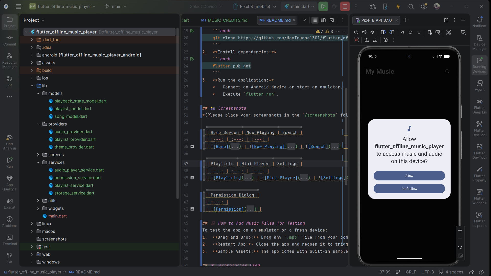

# Flutter Music Player - Truong Vinh Hoa 🎵

A premium offline music player built with Flutter, featuring local file scanning, background playback, and a sleek Spotify-inspired dark UI.

## 📝 Project Description
This project is a fully functional music application developed as part of a Flutter Lab assignment. It allows users to browse their local music library, manage playlists, and enjoy high-quality audio playback with persistent state management and background service support.

## ✨ Key Features
*   **Smart Library Scanning:** Automatically detects audio files from device storage (Android) and app assets.
*   **Background Playback:** Integrated with `audio_service` to allow music to play while the app is minimized or the screen is locked.
*   **Playlist Management:** Users can create custom playlists and add/remove songs dynamically.
*   **Modern UI/UX:** Spotify-inspired dark theme with smooth transitions, mini-player, and intuitive navigation.
*   **Search Engine:** Instant search functionality to find tracks by title, artist, or album.
*   **Modern Permissions:** Optimized for Android 13+ (READ_MEDIA_AUDIO) and iOS media library access.
*   **Sleep Timer:** Set a timer to automatically pause music (perfect for bedtime).
*   **Persistent State:** Saves your last played song, shuffle mode, and repeat settings.

## 🚀 Setup & Installation
1.  **Clone the Repo:**
    ```bash
    git clone https://github.com/HoaTruong1301/flutter_offline_music_player_truongvinhhoa.git
    ```
2.  **Install Dependencies:**
    ```bash
    flutter pub get
    ```
3.  **Run the App:**
    *   For Android: `flutter run`
    *   For iOS: `cd ios && pod install && cd .. && flutter run`

## 📸 Screenshots
*(Please place your screenshots in the `/screenshots` folder)*

| Home Screen | Now Playing | Search |
| :---: | :---: | :---: |
|  |  |  |

| Playlists | Mini Player | Song Options |
| :---: | :---: | :---: |
|  |  |  |

| Permission Dialog |
| :---: |
|  |

## 🧪 How to Add Music for Testing
### On Emulator (Android):
1.  **Drag and Drop:** Drag any `.mp3` file from your computer and drop it onto the Emulator screen.
2.  **Location:** Files are usually saved in the `/sdcard/Download` folder.
3.  **Scan:** Restart the app to trigger a local storage scan.

### On Simulator (iOS):
*   The app is pre-configured with **Sample Assets** located in `assets/audio/sample_songs/` (e.g., "Không Buông", "Beauty And A Beat").

## 🛠 Technologies Used
*   **Flutter & Dart:** Core framework.
*   **just_audio:** High-performance audio player engine.
*   **audio_service:** Background playback support and lock-screen controls.
*   **on_audio_query:** Local media library indexing and metadata retrieval.
*   **provider:** Reactive state management.
*   **permission_handler:** Cross-platform permission management.
*   **device_info_plus:** For API-level specific logic.

## 📜 Music Attribution
Full credits for sample songs can be found in the [MUSIC_CREDITS.md](MUSIC_CREDITS.md) file.

## ⚠️ Known Limitations
*   Album art display depends on metadata embedded within the audio files.
*   iOS local storage scanning is restricted to the Media Library (iTunes Sync).

## 🔮 Future Improvements
- [ ] Graphic Equalizer & Bass Boost.
- [ ] Lyric synchronization (.lrc support).
- [ ] Folder-based browsing.
